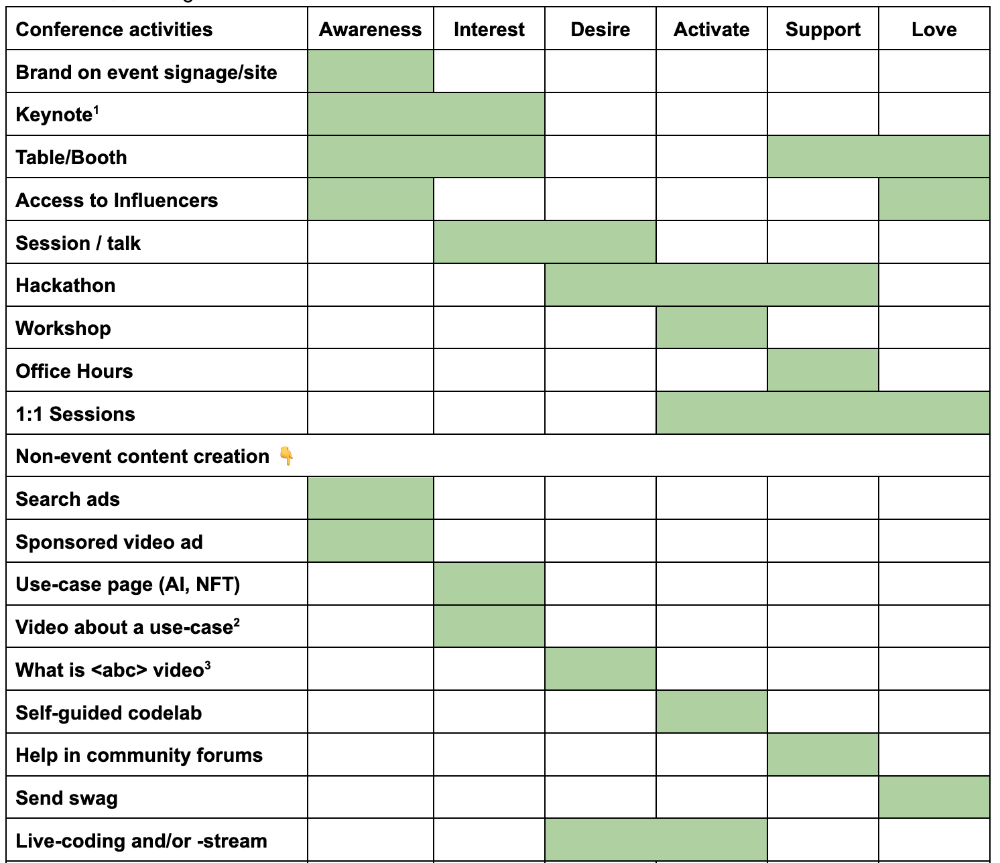

I often use a marketing funnel when deciding on DevRel activities. If you're not familiar with it, this is what a simple, pretty traditional marketing funnel looks like:

<svg width="640" height="420" viewBox="0 0 900 620" xmlns="http://www.w3.org/2000/svg" role="img" aria-labelledby="title desc">
  <title id="title">AIDA Funnel</title>
  <desc id="desc">Four-stage marketing funnel labeled Attention, Interest, Desire, and Action.</desc>

  

  <rect x="0" y="0" width="900" height="620" fill="#ffffff"/>

  <polygon points="180,60 720,60 630,165 270,165" fill="#F4DDCB" />
  <text class="label" x="450" y="125" text-anchor="middle" dominant-baseline="middle">Awareness</text>

  <polygon points="270,165 630,165 565,275 335,275" fill="#FBE7A7" />
  <text class="label" x="450" y="220" text-anchor="middle" dominant-baseline="middle">Interest</text>

  <polygon points="335,275 565,275 520,390 380,390" fill="#F7E58F" />
  <text class="label" x="450" y="330" text-anchor="middle" dominant-baseline="middle">Desire</text>

  <polygon points="380,390 520,390 450,560" fill="#F6CB66" />
  <text class="label" x="450" y="455" text-anchor="middle" dominant-baseline="middle">Action</text>

  <g aria-hidden="true">
    <text class="side" x="750" y="95">Get attention</text>
    <text class="side" x="750" y="205">Engage with value</text>
    <text class="side" x="750" y="315">Build desire</text>
    <text class="side" x="750" y="455">Prompt conversion</text>
  </g>

  <ellipse cx="450" cy="585" rx="170" ry="12" fill="#e5e7eb"/>
</svg>

The concept of this funnel is that you want people to take action (buy your product), but in order to do that they must first want your product. And they can't desire the product without first having an interest in it. And to gain an interest in something they must first be aware of it.

The theory goes that you help people progress towards the desired action, one step at a time. At each step you’ll see both conversions (people who advance) and drop-off (people who don’t) - and the value of a user increases at every step.

The funnel is a great tool because it visualizes the progress, and helps you to think of what specific action you can take at each step.

--- 

The origin of the AIDA model

The marketing funnel concept originates from the late 19th century and is attributed to American advertising pioneer Elias St. Elmo Lewis. Lewis developed a model to map the customer journey using a hierarchical, four-step process for effective advertising and salesmanship. This model is known by the acronym AIDA: 

* Awareness (or Attention): Attract a viewer's attention.
* Interest: Maintain their interest in the product or service.
* Desire: Create a desire or conviction that they want the product.
* Action: Spur them to take action and make a purchase. 

Thinking of these phases and funnel helps businesses plan and measure efforts to attract, engage, and convert prospects by tailoring messaging to their needs at each stage.

---

When I ran the Firebase events program at Google, we added some additional phases and flipped the funnel to be horizontal, so it was easier to use in docs and presentations.

<svg width="640" height="300" viewBox="0 0 1400 640" xmlns="http://www.w3.org/2000/svg" role="img" aria-labelledby="title desc">
  <title id="title">Customer Journey Stacked Columns</title>
  <desc id="desc">Awareness, Interest, Desire, Activate, Support, Love/Promote as shrinking stacked rectangles across columns with dividers.</desc>

  

  <!-- Colors approximated from the screenshot -->
  <defs>
    <linearGradient id="shadeAw" x1="0" x2="0" y1="0" y2="1">
      <stop offset="0" stop-color="#F4DDCB"/>
      <stop offset="1" stop-color="#F2D3C0"/>
    </linearGradient>
    <linearGradient id="shadeIn" x1="0" x2="0" y1="0" y2="1">
      <stop offset="0" stop-color="#FBE7A7"/>
      <stop offset="1" stop-color="#F8E09A"/>
    </linearGradient>
    <linearGradient id="shadeDe" x1="0" x2="0" y1="0" y2="1">
      <stop offset="0" stop-color="#F7E58F"/>
      <stop offset="1" stop-color="#F3DB7F"/>
    </linearGradient>
    <linearGradient id="shadeAc" x1="0" x2="0" y1="0" y2="1">
      <stop offset="0" stop-color="#F6CB66"/>
      <stop offset="1" stop-color="#F1BE57"/>
    </linearGradient>
    <linearGradient id="shadeSu" x1="0" x2="0" y1="0" y2="1">
      <stop offset="0" stop-color="#E5B545"/>
      <stop offset="1" stop-color="#DCAA39"/>
    </linearGradient>
    <linearGradient id="shadeLo" x1="0" x2="0" y1="0" y2="1">
      <stop offset="0" stop-color="#D3A23A"/>
      <stop offset="1" stop-color="#C7942F"/>
    </linearGradient>
  </defs>

  <!-- Each box is 215 wide, so 6 boxes are 1290 -->
  <!-- Total height is 640, first box is 620, last one is 120 -->

  <rect x="50" y="1" width="215" height="620" fill="url(#shadeAw)" class="box"/>
  <text class="label" x="157.5" y="311" text-anchor="middle" dominant-baseline="middle">Awareness</text>

  <rect x="265" y="51" width="215" height="520" fill="url(#shadeIn)" class="box"/>
  <text class="label" x="372.5" y="311" text-anchor="middle" dominant-baseline="middle">Interest</text>

  <rect x="480" y="101" width="215" height="420" fill="url(#shadeDe)" class="box"/>
  <text class="label" x="587.5" y="311" text-anchor="middle" dominant-baseline="middle">Desire</text>

  <rect x="695" y="151" width="215" height="320" fill="url(#shadeAc)" class="box"/>
  <text class="label" x="802.5" y="311" text-anchor="middle" dominant-baseline="middle">Activate</text>

  <rect x="910" y="201" width="215" height="220" fill="url(#shadeSu)" class="box"/>
  <text class="label" x="1017.5" y="311" text-anchor="middle" dominant-baseline="middle">Support</text>

  <rect x="1125" y="251" width="215" height="120" fill="url(#shadeLo)" class="box"/>
  <text class="label" x="1232.5" y="311" text-anchor="middle" dominant-baseline="middle">
    <tspan x="1232.5" dy="-0.6em">Love / </tspan>
    <tspan x="1232.5" dy="1.2em">Promote</tspan>
  </text>
</svg>

The exact number of steps in the funnel and their labels don't matter all that much in my experience. What *does* matter is that you understand the journey your (potential) users take, and how you can best help them at each step (and get them to convert to the next step in the funnel).

For example, when considering having a presence at a specific event, what do you want to accomplish there? When I started working on Firebase it was pretty well-known already in the Angular community, thanks to some successful demos at ng-conf. But Firebase was hardly known in the Android and iOS communities at the time. So with the funnel in mind, we set  different goals for these events:

* ng-conf: primarily reconnect with existing users (Support) and fans (Love), while also trying to convince more non-users to become active (Desire→Activate)
* AnDevCon[^1]: primarily raise awareness of Firebase among Android developers (Awareness), hopefully also growing excitement (Interest), and maybe get some to try it out (Desire→Activate).

These different goals led us to choose different activities at each event. 

* To raise awareness it really helped to have our name on the signage of the event.
* To create interest, we'd try to make quick connections with folks, e.g. a booth with simple, joyful swag (or unusual swag: like [Firebase hot sauce](https://firebase.blog/posts/2014/01/firebase-at-ng-conf-2014/)) or a coffee machine.
* To raise people's interest further, it was great to have a (non-sponsored) talk on the schedule, where someone from our team would show a demo of building something with Firebase.
* Activating folks can be done at the conference in a workshop. That was always somewhat limited in capacity though (and very expensive), so we'd also bring discount coupons for folks as a reminder to take home and try it out there.
* To support our existing users, we'd want a booth where we'd have enough space to open a few laptops and troubleshoot things.

Over time this process turned into our so-called events activity map:

| Conference activities |&nbsp;Awareness&nbsp;|&nbsp;Interest&nbsp;|&nbsp;Desire&nbsp;|&nbsp;Activate&nbsp;|&nbsp;Support&nbsp;|&nbsp;Love&nbsp;|
| :---- | :--: | :--: | :--: | :--: | :--: | :--: |
| **Brand on signage** |
&nbsp;
|  |  |  |  |  |
| **Keynote** |
&nbsp;
|
&nbsp;
|  |  |  |  |
| **Table/Booth** |  |
&nbsp;
|  |  |
&nbsp;
|
&nbsp;
|
| **Session / talk** |  |
&nbsp;
|
&nbsp;
|  |  |  |
| **Hackathon** |  |  |
&nbsp;
|
&nbsp;
|
&nbsp;
|  |
| **Workshop** |  |  |  |
&nbsp;
|  |  |
| **Office Hours** |  |  |  |  |
&nbsp;
|  |
| **1:1 Sessions** |  |  |  |
&nbsp;
|
&nbsp;
|
&nbsp;
|

This was a handy table we'd consult for every event we were considering to map our goals to activities we could put on there.

Later we started expanding this activity map/matrix to also include non-event related activities. 

An activity map is equally suited for non-event activities, but we ran out of steam quickly; it turns out there's an almost infinite number of useful activities you can do. For us it was more important to use the model than to have an exhaustive list of activities and a complete map. 

For another way of looking at DevRel's work and how an (even incomplete) visual model can be useful to share with stakeholders, I recommend Timothy Jordan's [DevRel Lifecycle](https://timothyjordan.com/blog/2025/07/10/DevRel-Lifecycle.html).

---

[^1]: AnDevCon was a series of Android events that was active in the US from 2012 until 2017. It no longer exists today.